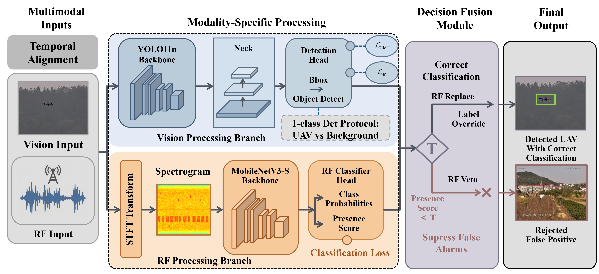

# RFVS: A Synchronized Multimodal RF-Vision Dataset for Tiny UAV Detection and Classification
## Description
RFVS is a synchronized multi-sensor framework and dataset that integrates visual images (RGB) and Radio Frequency (RF) signals for robust, long-range, and tiny drone (UAV) detection. This repository contains the core evaluation code, data preprocessing scripts, and the dataset necessary to reproduce the decision-level fusion results presented in our paper.

## Abstract
Unauthorized incursions by low, slow, and small unmanned aerial vehicles (UAVs) pose a critical security threat. Single-sensor approaches often struggle to meet the dual requirements of spatial localization and fine-grained classification simultaneously, due to severe texture deficiency in vision at long distances and the inherent lack of spatial coordinates in RF signals.

To address this gap, we present RFVS, a novel multimodal benchmark dataset based on strictly synchronized vision and RF sensing. Constructed in complex real-world environments, RFVS provides 2,531 visual bounding boxes across eight commercial drone categories, aligned at the frame level with raw wideband $I/Q$ signals. Furthermore, we propose a multimodal task-decoupling strategy (1-Class Det + RF-Replace). Our evaluations demonstrate that delegating spatial detection strictly to the visual branch and fine-grained classification to the RF branch significantly mitigates feature interference, robustly improving overall detection precision and effectively reducing the background false alarm rate to 0%.

##  Overall Architecture

Figure 1: RFVS Framework

<!-- <div align="center">

</div> -->


## Supported Environments and Hardware Requirements
The data processing and evaluation scripts are supported on the following environments:

### Operating Systems
Windows 11 / Ubuntu 22.04

### Software
- Python 3.x (for evaluation)
- MATLAB R2020a or later (for RF I/Q data preprocessing)

### Hardware Requirements
- CPU: Standard multi-core desktop CPU
- GPU: NVIDIA GPU (for running visual/RF model evaluation)

## Repository Structure
This repository focuses on data preprocessing and multimodal evaluation. The structure is organized as follows:
```
RFVS/
├── dataset/                   # Downloaded dataset directory (see Dataset section)
│   ├── images/                # Synchronized visual images (RGB)
│   ├── labels/                # Spatial bounding box labels (YOLO format)
│   ├── labels-class/          # Fine-grained UAV category labels
│   └── RF_raw/                # Raw wideband RF I/Q sampling data (.bin)
├── iq_to_stft.m               # Preprocessing: Converts raw IQ data to STFT spectrograms
├── eval.py                    # Evaluation: Computes multimodal fusion metrics & custom COCO mAP
└── README.md                  # Project documentation
```

## Dataset
The RFVS dataset was collected using a rigid dual-optical and RF acquisition platform across mountains, buildings, and open sky backgrounds. It encompasses 8 commercial drone categories (e.g., DJI Air 3, DJI Mavic 3 Pro, DJI Matrice 4E).

Due to the large size of the dataset (especially the raw wideband I/Q signals sampled at 153.6 MHz), the complete dataset is hosted on Google Drive.

- Download RFVS Dataset from Google Drive: (Insert your link here)
- Alternative Link: Zenodo / Baidu Netdisk (Optional)

### Data Preparation
After downloading, please extract the dataset into the root directory of this repository so that the `dataset/` folder aligns with the structure shown above.

## How to Run
To reproduce the evaluation metrics and data processing presented in our paper, follow these steps:

### 1. RF Data Preprocessing (MATLAB)
Raw RF data (RF_raw) consists of binary I/Q samples which cannot be directly fed into CNN/ViT models. We use the Short-Time Fourier Transform (STFT) to convert these signals into 2D time-frequency spectrograms.
1. Open `iq_to_stft.m` in MATLAB.
2. Verify that the sampling rate is set to match the dataset (Fs = 153.6e6).
3. Run the script. It will automatically parse the I/Q binary files, apply a Hamming window (length 1024, 512-sample overlap, 1024 FFT points), generate pure 2D spectrogram images without axes, and save them to a new `RF_images/` directory.

### 2. Evaluating the Models (Python)
We provide `eval.py` to evaluate the pure visual detection model (e.g., YOLOv11n) and the Vision-RF fusion models.

#### Key Features of eval.py
- **Fusion Strategies**: Implements the logic to replace the visual predicted category with the RF classifier's prediction. Supports Hard Replace and confidence-based RF-Gate mechanisms.
- **RF-Veto Mechanism**: Implements the background false alarm suppression logic. If the RF branch detects no UAV signal ($z_r = 0$), the visual bounding box is discarded.
- **Customized COCO Metrics**: To accurately characterize the minute-target distribution, we modified the COCO evaluation script. It replaces absolute pixel area with a normalized relative diagonal length ($d$) metric to calculate scale-wise precision ($mAP_{d-s}$, $mAP_{d-m}$, $mAP_{d-l}$).

#### Execution
Ensure your prediction results or model weights are properly configured in the script, then run:
```bash
python eval.py
```
(You can customize the script parameters inside `eval.py` depending on whether you want to evaluate 1-Class Det, 8-Class Det, or the fused 1-Class Det + RF-Replace strategy).

## Citation
If you use the RFVS dataset or the evaluation framework in your research, please cite our paper:
```bibtex
@article{YourName2026RFVS,
  title={RFVS: A Synchronized Multimodal RF-Vision Dataset for Tiny UAV Detection and Classification},
  author={Your Name and Co-authors},
  journal={Your Journal / Conference},
  year={2026}
}
```

## License
The RFVS dataset and the accompanied code are released under the MIT License.


